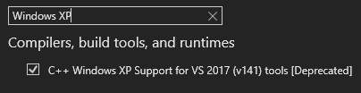

# Cave Story Mod Loader example mod
This is an example mod that can be compiled using Visual Studio 2022 for making dll mods for Cave Story freeware, using Clownacy's Mod Loader.

You'll first need a copy of [Visual Studio 2022](https://visualstudio.microsoft.com/downloads/). When you're installing it, go to the individual components tab and select the "C++ Windows XP Support for VS 2017 (v141) tools [Deprecated].

